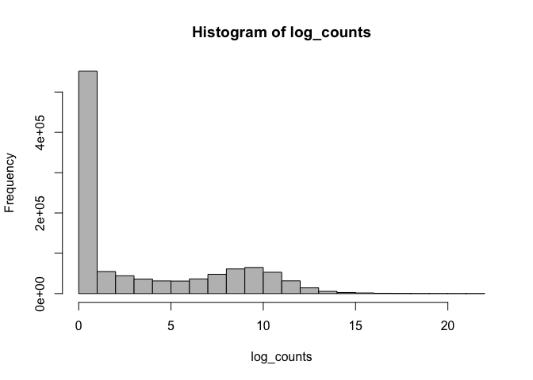
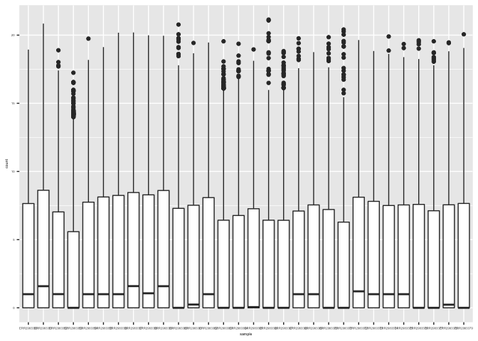
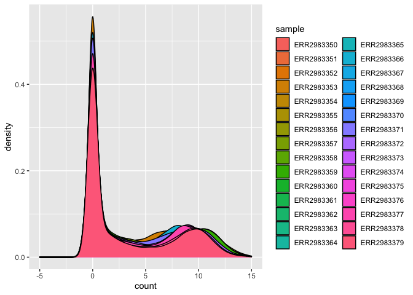
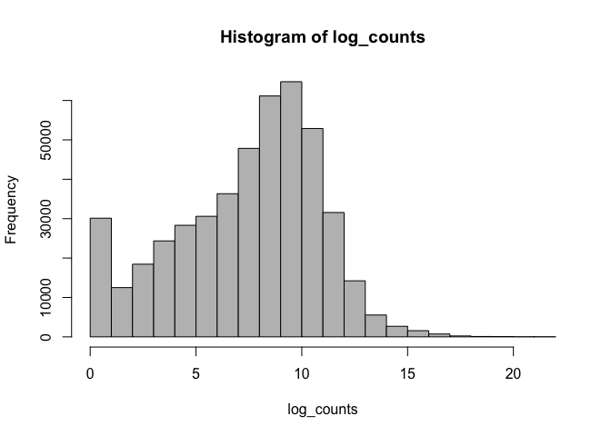
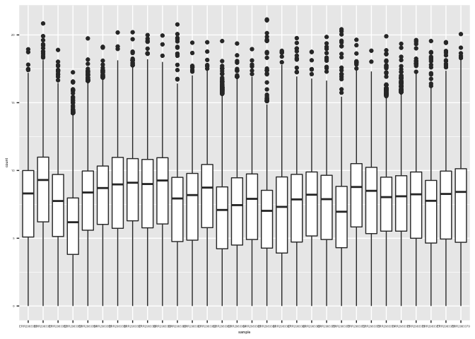
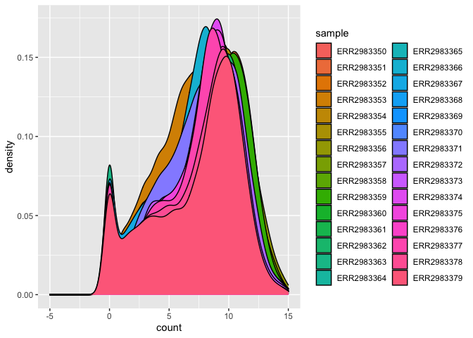

```r
#Load libraries
library(tidyverse)
```

```
## ── Attaching packages ────────────────────────────────────────────────────────────── tidyverse 1.3.0 ──
```

```
## ✓ ggplot2 3.3.0.9000     ✓ purrr   0.3.4     
## ✓ tibble  3.0.1          ✓ dplyr   0.8.5     
## ✓ tidyr   1.0.2.9000     ✓ stringr 1.4.0     
## ✓ readr   1.3.1          ✓ forcats 0.5.0
```

```
## ── Conflicts ───────────────────────────────────────────────────────────────── tidyverse_conflicts() ──
## x dplyr::filter() masks stats::filter()
## x dplyr::lag()    masks stats::lag()
```

```r
library(ggplot2)
library(tximport)
```

```
## Warning: package 'tximport' was built under R version 3.6.3
```

```r
library(tximportData)
library(edgeR)
```

```
## Loading required package: limma
```

```r
library(tximport)
library(tximportData)
library(ensembldb)
```

```
## Loading required package: BiocGenerics
```

```
## Loading required package: parallel
```

```
## 
## Attaching package: 'BiocGenerics'
```

```
## The following objects are masked from 'package:parallel':
## 
##     clusterApply, clusterApplyLB, clusterCall, clusterEvalQ,
##     clusterExport, clusterMap, parApply, parCapply, parLapply,
##     parLapplyLB, parRapply, parSapply, parSapplyLB
```

```
## The following object is masked from 'package:limma':
## 
##     plotMA
```

```
## The following objects are masked from 'package:dplyr':
## 
##     combine, intersect, setdiff, union
```

```
## The following objects are masked from 'package:stats':
## 
##     IQR, mad, sd, var, xtabs
```

```
## The following objects are masked from 'package:base':
## 
##     anyDuplicated, append, as.data.frame, basename, cbind, colnames,
##     dirname, do.call, duplicated, eval, evalq, Filter, Find, get, grep,
##     grepl, intersect, is.unsorted, lapply, Map, mapply, match, mget,
##     order, paste, pmax, pmax.int, pmin, pmin.int, Position, rank,
##     rbind, Reduce, rownames, sapply, setdiff, sort, table, tapply,
##     union, unique, unsplit, which, which.max, which.min
```

```
## Loading required package: GenomicRanges
```

```
## Loading required package: stats4
```

```
## Loading required package: S4Vectors
```

```
## Warning: package 'S4Vectors' was built under R version 3.6.3
```

```
## 
## Attaching package: 'S4Vectors'
```

```
## The following objects are masked from 'package:dplyr':
## 
##     first, rename
```

```
## The following object is masked from 'package:tidyr':
## 
##     expand
```

```
## The following object is masked from 'package:base':
## 
##     expand.grid
```

```
## Loading required package: IRanges
```

```
## 
## Attaching package: 'IRanges'
```

```
## The following objects are masked from 'package:dplyr':
## 
##     collapse, desc, slice
```

```
## The following object is masked from 'package:purrr':
## 
##     reduce
```

```
## Loading required package: GenomeInfoDb
```

```
## Warning: package 'GenomeInfoDb' was built under R version 3.6.3
```

```
## Loading required package: GenomicFeatures
```

```
## Loading required package: AnnotationDbi
```

```
## Loading required package: Biobase
```

```
## Welcome to Bioconductor
## 
##     Vignettes contain introductory material; view with
##     'browseVignettes()'. To cite Bioconductor, see
##     'citation("Biobase")', and for packages 'citation("pkgname")'.
```

```
## 
## Attaching package: 'AnnotationDbi'
```

```
## The following object is masked from 'package:dplyr':
## 
##     select
```

```
## Loading required package: AnnotationFilter
```

```
## 
## Attaching package: 'ensembldb'
```

```
## The following object is masked from 'package:dplyr':
## 
##     filter
```

```
## The following object is masked from 'package:stats':
## 
##     filter
```

```r
library(biomaRt)
```

```
## Warning: package 'biomaRt' was built under R version 3.6.3
```

```r
library(EnsDb.Hsapiens.v86)
library(reshape2)
```

```
## 
## Attaching package: 'reshape2'
```

```
## The following object is masked from 'package:tidyr':
## 
##     smiths
```


```r
#Import and clean meta-data from E-MTAB-7456
dir <- "/Users/ryanstubbins/Downloads/Git_rjs393/E-MTAB-7456/rnaseq/raw_counts"

samples <- read.table("/Users/ryanstubbins/Downloads/Git_rjs393/E-MTAB-7456/E-MTAB-7456.txt", header = TRUE, fill = TRUE)

samples <- samples[ -c(1, 5:6, 8:9, 10, 11, 14:20, 22:24, 25:42, 44, 47:59)]

samples <- samples[ -c(11:19)]

samples <- samples[ -c(1, 9)]

samples <- column_to_rownames(samples, var = "Assay")

samples <- as.data.frame(samples)

colnames(samples)[1] <- "ENA"
colnames(samples)[2] <- "BioSD"
colnames(samples)[3] <- "age_yrs"
colnames(samples)[4] <- "sex"
colnames(samples)[5] <- "accession"
colnames(samples)[6] <- "status"
colnames(samples)[7] <- "protocol"

samples <- samples[c(3,4,6,5,1,2,7)]
```


```r
#Summarize transcript abundancies to genes with txImport
edb <- EnsDb.Hsapiens.v86

tx2gene <- transcripts(edb, columns = c("tx_id", "gene_name"), filter=AnnotationFilterList(), return.type="DataFrame")

data <- c("/Users/ryanstubbins/Downloads/Git_rjs393/E-MTAB-7456/rnaseq/raw_counts/ERR2983350.tsv",
          "/Users/ryanstubbins/Downloads/Git_rjs393/E-MTAB-7456/rnaseq/raw_counts/ERR2983351.tsv",
          "/Users/ryanstubbins/Downloads/Git_rjs393/E-MTAB-7456/rnaseq/raw_counts/ERR2983352.tsv",
          "/Users/ryanstubbins/Downloads/Git_rjs393/E-MTAB-7456/rnaseq/raw_counts/ERR2983353.tsv",
          "/Users/ryanstubbins/Downloads/Git_rjs393/E-MTAB-7456/rnaseq/raw_counts/ERR2983354.tsv",
          "/Users/ryanstubbins/Downloads/Git_rjs393/E-MTAB-7456/rnaseq/raw_counts/ERR2983355.tsv",
          "/Users/ryanstubbins/Downloads/Git_rjs393/E-MTAB-7456/rnaseq/raw_counts/ERR2983356.tsv",
          "/Users/ryanstubbins/Downloads/Git_rjs393/E-MTAB-7456/rnaseq/raw_counts/ERR2983357.tsv",
          "/Users/ryanstubbins/Downloads/Git_rjs393/E-MTAB-7456/rnaseq/raw_counts/ERR2983358.tsv",
          "/Users/ryanstubbins/Downloads/Git_rjs393/E-MTAB-7456/rnaseq/raw_counts/ERR2983359.tsv",
          "/Users/ryanstubbins/Downloads/Git_rjs393/E-MTAB-7456/rnaseq/raw_counts/ERR2983360.tsv",
          "/Users/ryanstubbins/Downloads/Git_rjs393/E-MTAB-7456/rnaseq/raw_counts/ERR2983361.tsv",
          "/Users/ryanstubbins/Downloads/Git_rjs393/E-MTAB-7456/rnaseq/raw_counts/ERR2983362.tsv",
          "/Users/ryanstubbins/Downloads/Git_rjs393/E-MTAB-7456/rnaseq/raw_counts/ERR2983363.tsv",
          "/Users/ryanstubbins/Downloads/Git_rjs393/E-MTAB-7456/rnaseq/raw_counts/ERR2983364.tsv",
          "/Users/ryanstubbins/Downloads/Git_rjs393/E-MTAB-7456/rnaseq/raw_counts/ERR2983365.tsv",
          "/Users/ryanstubbins/Downloads/Git_rjs393/E-MTAB-7456/rnaseq/raw_counts/ERR2983366.tsv",
          "/Users/ryanstubbins/Downloads/Git_rjs393/E-MTAB-7456/rnaseq/raw_counts/ERR2983367.tsv",
          "/Users/ryanstubbins/Downloads/Git_rjs393/E-MTAB-7456/rnaseq/raw_counts/ERR2983368.tsv",
          "/Users/ryanstubbins/Downloads/Git_rjs393/E-MTAB-7456/rnaseq/raw_counts/ERR2983369.tsv",
          "/Users/ryanstubbins/Downloads/Git_rjs393/E-MTAB-7456/rnaseq/raw_counts/ERR2983370.tsv",
          "/Users/ryanstubbins/Downloads/Git_rjs393/E-MTAB-7456/rnaseq/raw_counts/ERR2983371.tsv",
          "/Users/ryanstubbins/Downloads/Git_rjs393/E-MTAB-7456/rnaseq/raw_counts/ERR2983372.tsv",
          "/Users/ryanstubbins/Downloads/Git_rjs393/E-MTAB-7456/rnaseq/raw_counts/ERR2983373.tsv",
          "/Users/ryanstubbins/Downloads/Git_rjs393/E-MTAB-7456/rnaseq/raw_counts/ERR2983374.tsv",
          "/Users/ryanstubbins/Downloads/Git_rjs393/E-MTAB-7456/rnaseq/raw_counts/ERR2983375.tsv",
          "/Users/ryanstubbins/Downloads/Git_rjs393/E-MTAB-7456/rnaseq/raw_counts/ERR2983376.tsv",
          "/Users/ryanstubbins/Downloads/Git_rjs393/E-MTAB-7456/rnaseq/raw_counts/ERR2983377.tsv",
          "/Users/ryanstubbins/Downloads/Git_rjs393/E-MTAB-7456/rnaseq/raw_counts/ERR2983378.tsv",
          "/Users/ryanstubbins/Downloads/Git_rjs393/E-MTAB-7456/rnaseq/raw_counts/ERR2983379.tsv")

txi <- tximport(data,
              type = "kallisto",
              tx2gene = tx2gene,
              ignoreTxVersion = TRUE)
```

```
## Note: importing `abundance.h5` is typically faster than `abundance.tsv`
```

```
## reading in files with read_tsv
```

```
## 1 2 3 4 5 6 7 8 9 10 11 12 13 14 15 16 17 18 19 20 21 22 23 24 25 26 27 28 29 30 
## transcripts missing from tx2gene: 11043
## summarizing abundance
## summarizing counts
## summarizing length
```

```r
counts <- as.data.frame(txi$counts)

colnames(txi$counts) <- rownames(samples)
colnames(counts) <- rownames(samples)
```


```r
#Data visualization and filtering
log_counts <- log2(counts + 1)
log_counts <- as.matrix(log_counts)

hist_pre <- hist(log_counts, col = "gray")
```

<!-- -->

```r
hist_pre
```

```
## $breaks
##  [1]  0  1  2  3  4  5  6  7  8  9 10 11 12 13 14 15 16 17 18 19 20 21 22
## 
## $counts
##  [1] 551652  54735  44203  36084  31377  31040  36418  47869  61164  64772
## [11]  52894  31567  14225   5545   2678   1569    723    228     93     52
## [21]     10      2
## 
## $density
##  [1] 5.160932e-01 5.120685e-02 4.135373e-02 3.375807e-02 2.935448e-02
##  [6] 2.903920e-02 3.407054e-02 4.478342e-02 5.722144e-02 6.059688e-02
## [11] 4.948452e-02 2.953223e-02 1.330807e-02 5.187576e-03 2.505379e-03
## [16] 1.467864e-03 6.763963e-04 2.133034e-04 8.700533e-05 4.864814e-05
## [21] 9.355412e-06 1.871082e-06
## 
## $mids
##  [1]  0.5  1.5  2.5  3.5  4.5  5.5  6.5  7.5  8.5  9.5 10.5 11.5 12.5 13.5 14.5
## [16] 15.5 16.5 17.5 18.5 19.5 20.5 21.5
## 
## $xname
## [1] "log_counts"
## 
## $equidist
## [1] TRUE
## 
## attr(,"class")
## [1] "histogram"
```

```r
counts <- as.matrix(counts)

melt_counts <- melt(log_counts)
colnames(melt_counts)[1] <- "gene"
colnames(melt_counts)[2] <- "sample"
colnames(melt_counts)[3] <- "count"

box_pre <- melt_counts %>%
  ggplot(aes(x = sample, y = count)) +
  geom_boxplot() + 
  theme(text = element_text(size=4))

box_pre
```

<!-- -->

```r
density_pre <- melt_counts %>%
  ggplot(aes(x = count, fill = sample)) +
  geom_density() + 
  xlim(-5, 15)

density_pre
```

```
## Warning: Removed 2677 rows containing non-finite values (stat_density).
```

<!-- -->

```r
dim(counts)
```

```
## [1] 35630    30
```

```r
#Create DGEList object for the coounts
dgList <- DGEList(counts = counts, genes = rownames(counts), samples = samples)

#Convert counts to CPM > 1 in at least 2 samples
cpm <- cpm(dgList)

cutoff <- cpm > 1

keep <- which(rowSums(cutoff) >= 2)
dgList <- dgList[keep,]

dim(dgList)
```

```
## [1] 15467    30
```

```r
#Calculate normalization factors with TMM
dgList <- calcNormFactors(dgList, method="TMM")

#Visualize post-fitler
log_counts <- log2(dgList$counts + 1)
log_counts <- as.matrix(log_counts)

hist_post <- hist(log_counts, col = "gray")
```

<!-- -->

```r
hist_post
```

```
## $breaks
##  [1]  0  1  2  3  4  5  6  7  8  9 10 11 12 13 14 15 16 17 18 19 20 21 22
## 
## $counts
##  [1] 30123 12502 18440 24354 28319 30599 36334 47843 61148 64766 52890 31567
## [13] 14225  5545  2678  1569   723   228    93    52    10     2
## 
## $density
##  [1] 6.491886e-02 2.694338e-02 3.974052e-02 5.248594e-02 6.103101e-02
##  [6] 6.594470e-02 7.830435e-02 1.031077e-01 1.317816e-01 1.395789e-01
## [11] 1.139846e-01 6.803086e-02 3.065667e-02 1.195017e-02 5.771427e-03
## [16] 3.381393e-03 1.558156e-03 4.913687e-04 2.004267e-04 1.120666e-04
## [21] 2.155126e-05 4.310252e-06
## 
## $mids
##  [1]  0.5  1.5  2.5  3.5  4.5  5.5  6.5  7.5  8.5  9.5 10.5 11.5 12.5 13.5 14.5
## [16] 15.5 16.5 17.5 18.5 19.5 20.5 21.5
## 
## $xname
## [1] "log_counts"
## 
## $equidist
## [1] TRUE
## 
## attr(,"class")
## [1] "histogram"
```

```r
melt_counts <- melt(log_counts)
colnames(melt_counts)[1] <- "gene"
colnames(melt_counts)[2] <- "sample"
colnames(melt_counts)[3] <- "count"

box_post <- melt_counts %>%
  ggplot(aes(x = sample, y = count)) +
  geom_boxplot() + 
  theme(text = element_text(size=4))

box_post
```

<!-- -->

```r
density_post <- melt_counts %>%
  ggplot(aes(x = count, fill = sample)) +
  geom_density() + 
  xlim(-5, 15)

density_post
```

```
## Warning: Removed 2677 rows containing non-finite values (stat_density).
```

<!-- -->

```r
dim(dgList$counts)
```

```
## [1] 15467    30
```

```r
counts_post <- dgList$counts
samples_post <- dgList$samples
```
